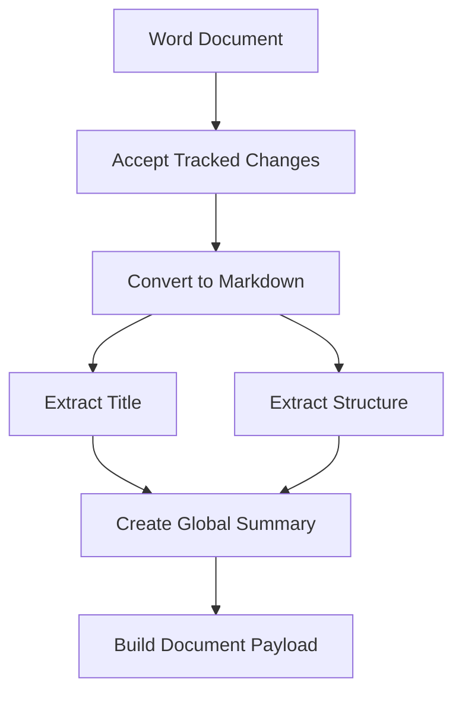
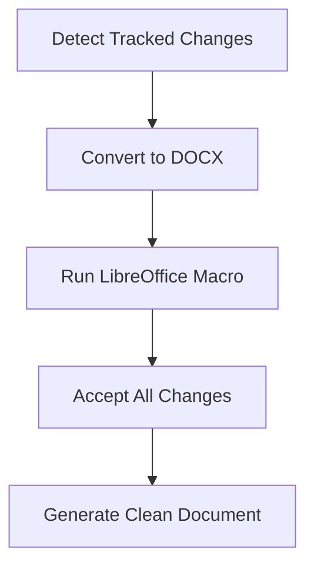
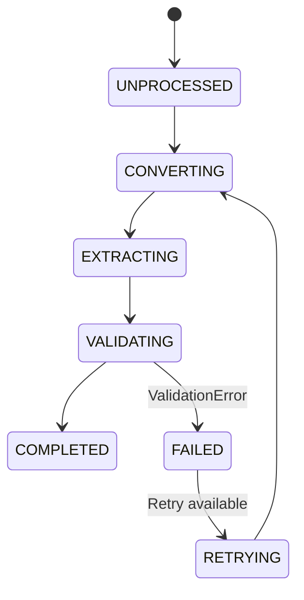

# Word Processor Component Design

## 1. Overview
Component responsible for processing Word documents (.doc/.docx) to extract structured information for embedding. Integrates with document conversion services and LLMs.



## 2. Processing Stages & Error Handling

### Stage 1: Document Preparation & Tracked Changes (Linux-Compatible)

#### Tracked Changes Workflow


#### Key Features:
- **LibreOffice-Based Solution**:
  - Uses `soffice` command-line tool
  - Runs `AcceptAllChanges` macro automatically
  - Works offline on Linux systems
- **Revision Handling**:
  - Accepts all changes by default
  - Preserves original as backup
  - Configurable through `revision_strategy` parameter

#### Error Handling:
- `LibreOfficeError`: Check installation and permissions
- `MacroExecutionError`: Verify macro compatibility
- `RevisionAcceptanceError`: Fallback to original document
- `UnsupportedFormatError`: Skip processing, log critical error

### Stage 2: Format Conversion
- **PDF/DOCX Conversion**: Configurable via `processing_params.word.conversion_mode`
- **Error Handling**:
  - `ConversionTimeoutError`: Retry 3x with exponential backoff
  - `CorruptedFileError`: Move to quarantine directory

### Stage 3: Content Extraction
- **Title Extraction**: Uses initial 20% of document with filename fallback
- **Structure Extraction**:
  - **Small Documents** (<= small_doc_threshold_tokens):
    - LLM-based hierarchical parsing (max depth=2)
  - **Large Documents** (> small_doc_threshold_tokens):
    - Markdown heading parser (H1/H2 only)
    - No LLM required
- **Global Summary**: Aggregates section summaries

### Stage 4: Payload Construction
- Validates against `WordDocumentPayload` Pydantic model
- Error Handling: `ValidationError` triggers reprocessing from Stage 3

## 3. Configuration Parameters

```yaml
# config.yaml
processing_params:
  word:
    conversion_mode: "pdf"  # or "docx"
    small_doc_threshold_tokens: 4096
    title_extraction_strategy: "first_20_percent"
    max_retries: 3
    quarantine_path: "/tmp/quarantine"
```

## 4. State Management Integration (Cross-Component)

*Note: A unified state management system for all pipeline components will be designed in a separate document (state_management_design.md)*

### Word Processor State Transitions:


### State Payload:
```python
class WordProcessorState(BaseModel):
    file_path: str
    current_stage: ProcessingStage
    retry_count: int = 0
    last_error: Optional[str] = None
    metadata: dict = {}
```

## 5. Centralized Logging Strategy

### Configuration:
```yaml
# config.yaml
logging:
  global_level: "INFO"
  components:
    parsing: "DEBUG"
    metadata_extraction: "INFO"
    formatting: "WARNING"
    qdrant_ingestion: "ERROR"
    state_management: "DEBUG"
```

### Implementation:
1. **Centralized Logger Factory**:
   ```python
   from utils.logging_setup import get_component_logger
   logger = get_component_logger(__name__)
   ```
   
2. **Dynamic Level Control**:
   - Log levels reloaded on config changes
   - Component-specific filtering
   
3. **Structured Logging**:
   ```python
   logger.debug(
       "Document conversion started",
       extra={
           "component": "word_processor",
           "file": file_path.name,
           "conversion_mode": config.conversion_mode
       }
   )
   ```

### Benefits:
- Single configuration point
- Runtime log level adjustments
- Component-specific verbosity
- Consistent structured logging

## 6. Test Strategy

### Unit Tests:
1. Tracked changes acceptance with macro
2. Conversion failure scenarios
3. LLM response parsing edge cases
4. Markdown heading parser:
   - Various heading structures
   - Mixed heading levels
   - Documents without headings

### Integration Tests:
1. End-to-end processing with sample documents
2. Failure injection at each processing stage

### Performance Tests:
1. Document size scalability (1MB - 10MB)
2. Concurrent processing limits

## 7. Detailed Implementation Roadmap

### Phase 1: Core Processing (3 days)
- **Tracked Changes Handling**:
  - Implement LibreOffice macro integration
  - Add change acceptance workflow
  - Create backup system for original files
- **Conversion Service**:
  - Add configurable PDF/DOCX conversion
  - Implement quarantine handling
- **Content Extraction**:
  - Develop adaptive metadata extraction method based on document token length.
  
### Phase 2: State & Reliability (2 days)
- **State Management**:
  - Design state management for the whole project
  - Implement retry logic with exponential backoff
  - Add state persistence mechanism
- **Configuration**:
  - Centralize parameter loading
  - Implement config hot-reloading

### Phase 3: Observability (1 day)
- **Logging System**:
  - Implement component-specific loggers
  - Add structured logging with context
  - Create log rotation mechanism
- **Monitoring**:
  - Add Prometheus metrics endpoints
  - Implement health check API
  - Build dashboard for processing metrics

### Phase 4: Validation & Testing (2 days)
- **Test Suite**:
  - Unit tests for all new features
  - Integration tests for processing pipeline
  - Performance tests with large documents
- **Quality Assurance**:
  - Security audit of file handling
  - Error handling validation
  - Final performance benchmarking

### Milestones:
1. **M1**: Tracked changes handling complete (End of Phase 1)
2. **M2**: State management integrated (End of Phase 2)
3. **M3**: Centralized logging operational (End of Phase 3)
4. **M4**: Test coverage >90% (End of Phase 4)